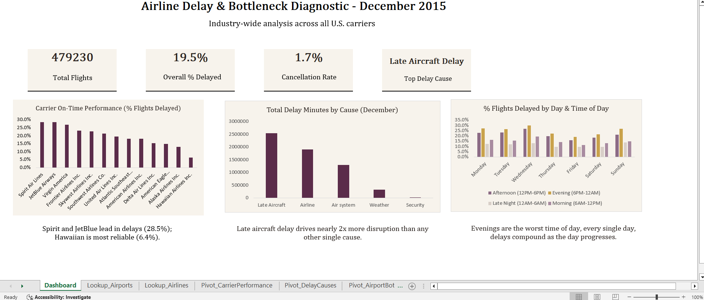

# Part 1: Excel - Airline Delay & Bottleneck Diagnostic

## Tool & Techniques

Built entirely in Excel using Power Query (data import and filtering), PivotTables, VLOOKUP-based lookups, nested IF formulas for categorization, and manually formatted dashboard cards and charts. No add-ins or external tools.

## Methodology

The raw dataset (2015 full-year U.S. flight data, ~5.8 million rows) was imported via Power Query and filtered to December before loading, since Excel's worksheet row limit (1,048,576 rows) cannot hold a full year of data. This filtering was done at the query stage rather than after loading, to avoid the risk of silent data truncation.

Two reference tables: airline codes and airport codes were merged into the main dataset using VLOOKUP (XLOOKUP was unavailable in this Excel version), adding readable carrier and airport names alongside the raw IATA codes. A validation pass confirmed zero unmatched (#N/A) codes after the merge.

Several helper columns were added to support analysis: an `IS_DELAYED` flag (arrival delay greater than 15 minutes, the U.S. DOT's standard definition of an on-time flight), a `TIME_OF_DAY` bucket derived from scheduled departure time, and a `DAY_NAME` field mapped from the numeric day-of-week column.

Four PivotTables were built to address each business question, followed by a single-page dashboard combining KPI summary cards, three curated charts, and short written insights.

## Key Findings

**Carrier performance:** Spirit Air Lines and JetBlue Airways had the worst on-time performance in December 2015, with 28.5% of flights delayed beyond 15 minutes. Hawaiian Airlines was the most reliable carrier by a wide margin, with only 6.4% of flights delayed and a negative average arrival delay, meaning its flights arrived early on average.

**Delay cause:** Late aircraft delay: where a plane's late arrival from a previous leg pushes back its next departure, was the single largest driver of December delays, accounting for over 2.5 million total delay-minutes, nearly double the next largest cause (carrier-related delays) and roughly eight times the impact of weather. This challenges the common assumption that weather is the primary cause of winter flight delays.

**Bottlenecks:** After filtering out low-volume airports to avoid small-sample distortion, San Francisco International Airport emerged as the clearest bottleneck, with 26.1% of its ~13,800 December flights delayed. Route-level analysis reinforced this: SFO appeared as the destination in nearly half of the worst-performing routes, sourced from geographically diverse origin cities, suggesting a structural issue at the airport itself rather than a problem isolated to specific carriers or routes.

**Time patterns:** Evening flights (6 PM–12 AM) were the most delayed time-of-day bucket on every single day of the week, ranging from 18.9% to 29.9% delayed depending on the day. This connects directly to the late-aircraft-delay finding: delays compound as the day progresses, so flights scheduled later in the day inherit disruption accumulated earlier in the network. Wednesday was the worst single day overall (24.2% delayed); Friday was the best (14.7%).

## Dashboard

## Note on Workbook File
The full workbook (~130MB, due to embedded Pivot data caches) is not uploaded here due to GitHub's file size limits. The dashboard screenshot above reflects the completed workbook. Happy to share the file directly on request.
